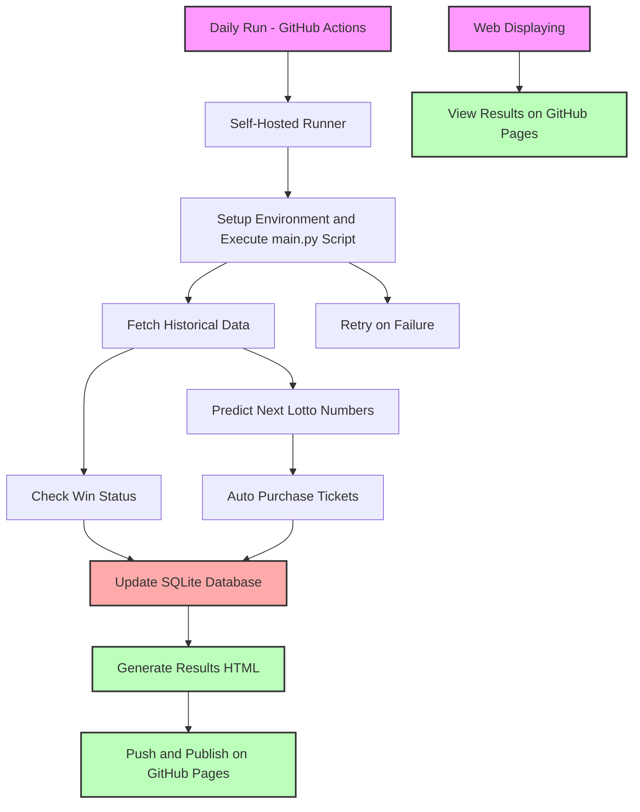

# Auto Market

[](https://github.com/L1nwatch/auto_market/actions/workflows/daily-run-main.yml)

[](https://github.com/L1nwatch/auto_market/actions/workflows/pages/pages-build-deployment)

## Project1: Auto Lotto

### Design Overview



### How to run daily

1. create a GitHub actions self-hosted runner

```shell
docker build -f github-runner.Dockerfile --build-arg OPENAI_API_KEY="$OPENAI_API_KEY" --build-arg RUNNER_TOKEN="$RUNNER_TOKEN" --build-arg LOTTO_USER="$LOTTO_USER" --build-arg LOTTO_PASSWORD="$LOTTO_PASSWORD" -t auto-lotto-github-runner .
docker run -d auto-lotto-github-runner
```

2. run the main script: `auto_lotto_main.py`

## Project2: Auto Stock Trading

[details](./auto_stock/README.md)