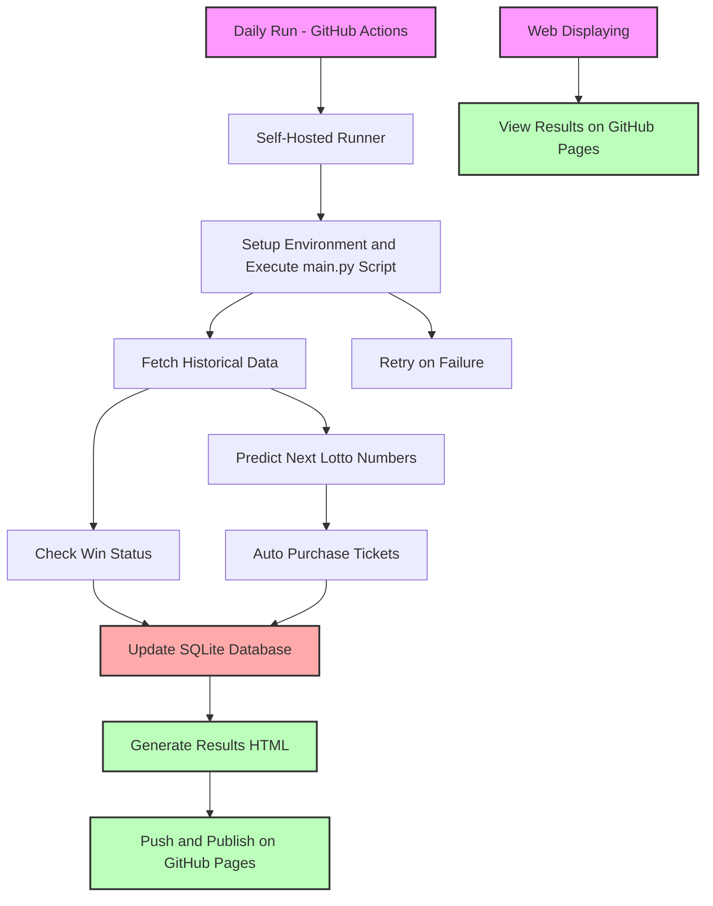

[En](./readme.md) | [中](./readme_zh.md)

# Auto Market

[](https://github.com/L1nwatch/auto_market/actions/workflows/daily-run-main.yml)

[](https://github.com/L1nwatch/auto_market/actions/workflows/pages/pages-build-deployment)


## Repository Overview

This repository hosts two automation projects:

1. **Auto Lotto** - generates lottery numbers with language models, buys tickets, and checks results.
2. **Auto Stock Trading** - demonstrates a simple stock trading strategy and logging (currently paused).

Key directories and files:
- `auto_lotto_main.py` orchestrates the lotto workflow.
- `utils/` contains helpers for predictions, scraping results, purchasing tickets, and database access.
- `auto_stock/` holds the trading scripts and its README.
- `docs/` publishes lotto outcomes via GitHub Pages.
- `github-runner.Dockerfile` builds the self-hosted runner used by GitHub Actions.

## Project1: Auto Lotto

This project uses various strategies to generate lottery numbers, automatically purchase tickets, and verify winning statuses.
The available predictors include:
1. **LLM** - a language model suggests numbers based on recent draws.
2. **Random** - generates purely random combinations.
3. **Frequency-weighted** - analyzes the last two years of draws and selects the most common numbers.

The purchased tickets and their results are displayed on GitHub Pages.
[https://l1nwatch.github.io/auto_market/](https://l1nwatch.github.io/auto_market/)

You can also view the frequency-weighted simulation results here:
[https://l1nwatch.github.io/auto_market/freq_simulation.html](https://l1nwatch.github.io/auto_market/freq_simulation.html)


### Design Overview



### How to run daily

The execution schedule is defined in
[`.github/workflows/daily-run-main.yml`](.github/workflows/daily-run-main.yml).
This GitHub Actions workflow runs `auto_lotto_main.py` every day at **14:00 UTC**
(9:00 AM Montreal time).

1. **Create a self-hosted runner**

   Build and start the runner container with your credentials:

```shell
docker build -f github-runner.Dockerfile \
  --build-arg OPENAI_API_KEY="$OPENAI_API_KEY" \
  --build-arg RUNNER_TOKEN="$RUNNER_TOKEN" \
  --build-arg LOTTO_USER="$LOTTO_USER" \
  --build-arg LOTTO_PASSWORD="$LOTTO_PASSWORD" \
  -t auto-lotto-github-runner .

docker run -d auto-lotto-github-runner
```

2. **Workflow execution**

   Once the runner is online, GitHub automatically triggers the workflow daily.
   You can also manually start it from the Actions tab using the
   `workflow_dispatch` option.

## Project2: Auto Stock Trading

An experimental bot that interacts with the Tonghuashun trading system to buy
recently dipped stocks and automatically place sell orders for profit or loss.
The scripts are paused but remain available for reference.

- [Chinese documentation](./auto_stock/README.md)
- [English documentation](./auto_stock/README_en.md)
