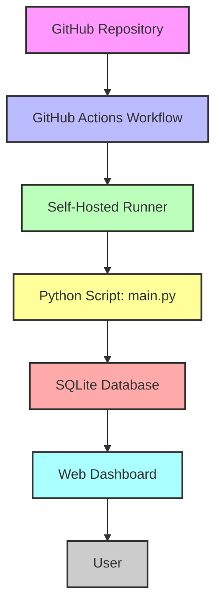

```mermaid
flowchart TD
    A[GitHub Repository] --> B[GitHub Actions Workflow]
    B --> C[Self-Hosted Runner]
    C --> D[Python Script: main.py]
    D --> E[SQLite Database]
    E --> F[Web Dashboard]
    F --> G[User]

    style A fill:#f9f,stroke:#333,stroke-width:2px
    style B fill:#bbf,stroke:#333,stroke-width:2px
    style C fill:#bfb,stroke:#333,stroke-width:2px
    style D fill:#ff9,stroke:#333,stroke-width:2px
    style E fill:#faa,stroke:#333,stroke-width:2px
    style F fill:#aff,stroke:#333,stroke-width:2px
    style G fill:#ccc,stroke:#333,stroke-width:2px
```