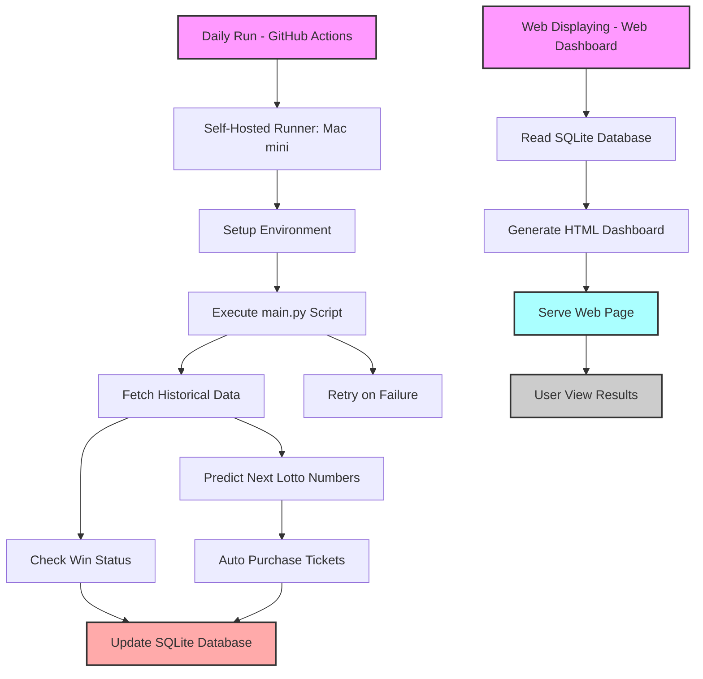

```mermaid
flowchart TD
    %% Root 1: Daily Run
    A[Daily Run - GitHub Actions] --> B[Self-Hosted Runner: Mac mini]
    B --> C[Setup Environment]
    C --> E[Execute main.py Script]
    E --> F[Fetch Historical Data]
    F --> G[Predict Next Lotto Numbers]
    G --> D[Auto Purchase Tickets]
    I --> H[Update SQLite Database]
    F --> I[Check Win Status]
    D --> H

    %% Additional Connections
    %% H --> K  
    %% Database shared between Daily Run and Web Display
    %% Failure Handling
    E --> R[Retry on Failure]   
    
    %% Root 2: Web Displaying
    Z[Web Displaying - Web Dashboard] --> K[Read SQLite Database]
    K --> L[Generate HTML Dashboard]
    L --> M[Serve Web Page]
    M --> N[User View Results]

    %% Styling
    style A fill:#f9f,stroke:#333,stroke-width:2px
    style Z fill:#f9f,stroke:#333,stroke-width:2px
    style H fill:#faa,stroke:#333,stroke-width:2px
    style M fill:#aff,stroke:#333,stroke-width:2px
    style N fill:#ccc,stroke:#333,stroke-width:2px
```