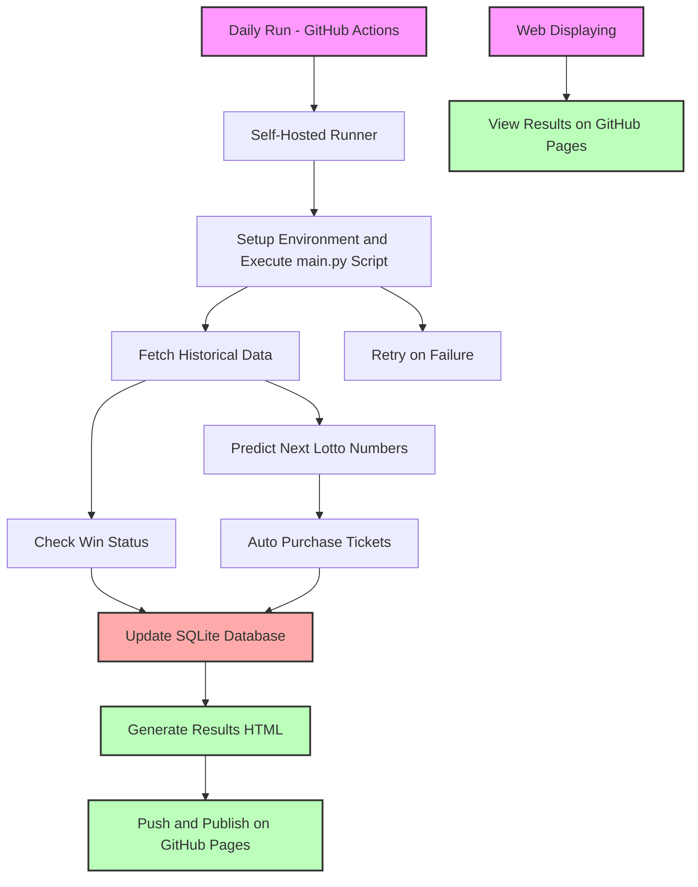

[En](./readme.md) | [中](./readme_zh.md)

# 自动市场

[](https://github.com/L1nwatch/auto_market/actions/workflows/daily-run-main.yml)
[](https://github.com/L1nwatch/auto_market/actions/workflows/pages/pages-build-deployment)
[](https://github.com/L1nwatch/auto_market/actions/workflows/run-tests.yml)

## 仓库概览

本仓库包含两个自动化项目：

1. **自动彩票** - 使用语言模型预测 Lotto 6/49 彩票号码，购买彩票并检查结果。
2. **自动股票交易** - 展示一个简单的股票交易策略和日志记录（目前暂停）。

主要目录和文件：
- `auto_lotto_main.py` 控制彩票工作流程。
- `utils/` 包含用于预测、抓取结果、购票和数据库访问的辅助模块。
- `auto_stock/` 存放交易脚本及其 README。
- `docs/` 通过 GitHub Pages 发布彩票结果。
- `github-runner.Dockerfile` 构建 GitHub Actions 使用的自托管 runner。

## 项目1：自动彩票

该项目预测 Lotto 6/49 彩票号码，自动购票并验证中奖情况。
该功能专门面向魁北克乐透（Loto‑Québec）的 Lotto 6/49，历史数据来自其官网，购票也通过 Loto‑Québec 在线平台完成，暂不支持其他加拿大的彩票系统。
可用的预测器包括：
1. **LLM** - 根据最近的开奖数据由语言模型给出号码建议。
2. **随机** - 生成完全随机的组合。
3. **按频率加权** - 根据历史开奖选择出现次数最多的号码，可模拟1-5年的历史数据。
4. **按最低频率加权** - 选择历史上出现次数最少的号码。

购买的彩票及其结果会展示在 GitHub Pages 上。
[https://l1nwatch.github.io/auto_market/](https://l1nwatch.github.io/auto_market/)

也可以在这里查看按频率加权的模拟结果：
[1年](https://l1nwatch.github.io/auto_market/freq_simulation_1_year.html) |
[2年](https://l1nwatch.github.io/auto_market/freq_simulation_2_year.html) |
[3年](https://l1nwatch.github.io/auto_market/freq_simulation_3_year.html) |
[4年](https://l1nwatch.github.io/auto_market/freq_simulation_4_year.html) |
[5年](https://l1nwatch.github.io/auto_market/freq_simulation_5_year.html) |
[全部年份](https://l1nwatch.github.io/auto_market/freq_simulation_all_years.html)

也可以在这里查看按最低频率加权的模拟结果：
[1年](https://l1nwatch.github.io/auto_market/least_freq_simulation_1_year.html) |
[2年](https://l1nwatch.github.io/auto_market/least_freq_simulation_2_year.html) |
[3年](https://l1nwatch.github.io/auto_market/least_freq_simulation_3_year.html) |
[4年](https://l1nwatch.github.io/auto_market/least_freq_simulation_4_year.html) |
[5年](https://l1nwatch.github.io/auto_market/least_freq_simulation_5_year.html) |
[全部年份](https://l1nwatch.github.io/auto_market/least_freq_simulation_all_years.html)


### 设计概览



### 如何每日运行

执行计划定义在
[`.github/workflows/daily-run-main.yml`](.github/workflows/daily-run-main.yml)。
该 GitHub Actions 工作流每天在 **14:00 UTC**（蒙特利尔时间上午 9 点）运行 `auto_lotto_main.py`。

1. **创建自托管 runner**

   使用你的凭据构建并启动 runner 容器：

```shell
docker build -f github-runner.Dockerfile \
  --build-arg OPENAI_API_KEY="$OPENAI_API_KEY" \
  --build-arg RUNNER_TOKEN="$RUNNER_TOKEN" \
  --build-arg LOTTO_USER="$LOTTO_USER" \
  --build-arg LOTTO_PASSWORD="$LOTTO_PASSWORD" \
  -t auto-lotto-github-runner .

docker run -d auto-lotto-github-runner
```

2. **工作流执行**

   runner 在线后，GitHub 会每天自动触发工作流。
   你也可以在 Actions 标签页手动启动，使用 `workflow_dispatch` 选项。

## 项目2：自动股票交易

这是一个与同花顺交易系统交互的实验性机器人，购买近期下跌的股票并自动设置止盈止损卖单。
脚本目前已暂停，但仍供参考。

- [中文文档](./auto_stock/README.md)
- [英文文档](./auto_stock/README_en.md)
